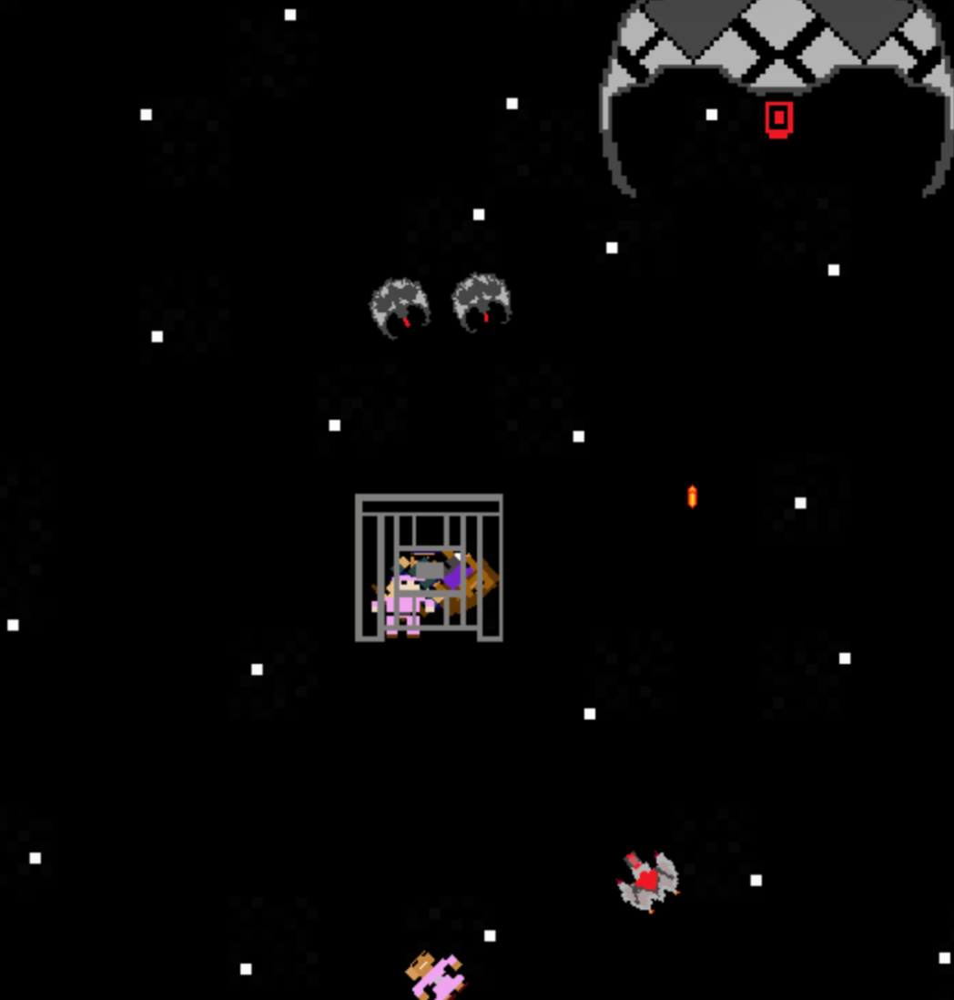

# User Guide

User Guide - The Last Invader 

Version: 1.0

Authors: Samuel Florez Garcia & Kimora Robinson

Last Updated: April 2026

--- 

Table of Contents
1. About the Game	
2. Game Screens	
3. Controls	
4. Objective	
5. Enemies	
6. Lives and Health	
7. Winning and Losing	
8. Tips for New Players	

---
 
1. About the Game
The Last Invader is a 2D top-down space shooter built with Python and Pygame. You play as a lone hero on a space battlefield, surrounded by alien invaders. Your mission is not just to survive, you must rescue 5 hostages before they drift out of bounds, defeat the alien threat, and escape through a portal to victory.

 
---

2. Game Screens

When you launch the game, you will be taken through several screens:

Main Menu - The first screen you see. It has three options:

•	Play - Starts a new game

•	Instructions - Opens the How to Play screen

•	Quit  - Exits the game

How to Play Screen - Displays the game objective, controls, and survival tips. Click the Home button in the top right to return to the main menu.

Game Screen - The main battlefield where gameplay takes place.

Pause Screen - Press ESC during gameplay to pause. Press ESC again to resume, or click the Home button to return to the main menu.

You Win Screen - Displayed when you successfully rescue all hostages and reach the portal.

You Lose Screen - Displayed when you run out of lives or a hostage escapes. You can choose to Play Again or return to the Home screen.
 
---

3. Controls

Action	Control

Move Up	W or ↑

Move Down	S or ↓

Move Left	A or ←

Move Right	D or →

Aim	Move your mouse

Shoot	Left mouse click

Pause / Unpause	ESC

Note: Your character automatically rotates to face your mouse cursor, so aiming is as simple as pointing your mouse at the target and clicking.
 
---

4. Objective

Your mission has two parts that must both be completed to win:

Part 1 - Rescue the Hostages

•	5 hostages are held inside a prison in the center of the battlefield

•	After a set amount of time, hostages begin drifting away from the prison

•	You must move into contact with each hostage to rescue them

•	If a hostage drifts out of bounds before you reach them, it is game over

•	A Character Count in the top right of the screen tracks how many hostages you have rescued

Part 2 - Escape Through the Portal

•	Once all 5 hostages are rescued, a portal appears on the battlefield

•	Navigate your character into the portal to complete the mission and win the game

 
---

5. Enemies

There are three types of enemies on the battlefield, all of which shoot bullets at your character:

Villain Spaceships (x2)

•	Two smaller villain spaceships actively chase your character around the battlefield

•	They rotate to always face you and shoot bullets in your direction

•	Each spaceship takes 10 hits to destroy

•	After being destroyed, they respawn after a short delay and resume attacking

•	Once all 5 hostages are rescued, the villains stop respawning

The Boss

•	A large boss enemy moves back and forth horizontally at the top of the screen

•	The boss shoots bullets at your character continuously

•	The boss cannot be destroyed -  focus on dodging its attacks

 
---

6. Lives and Health

•	You start with 5 lives, displayed as hearts in the top left corner of the screen

•	Each time you are hit by an enemy bullet, you lose half a heart

•	Hearts display in three states: 

o	Full heart - healthy

o	Half heart - partially damaged

o	Empty heart - lost

•	When all 5 hearts are empty, it is game over

---

7. Winning and Losing

You win when:

•	All 5 hostages are rescued AND

•	You navigate your character through the portal

You lose when:

•	All your hearts run out (hit by too many bullets), OR

•	A hostage drifts out of bounds before you rescue them

After either outcome, you can choose to Play Again or return to the Home screen.

---

8. Tips for New Players

•	Keep moving. Standing still makes you an easy target for villain bullets. Stay mobile at all times.

•	Prioritize hostages over enemies. Losing a hostage ends the game instantly. Always keep an eye on where they are drifting.

•	Use the prison as a shield. Your character cannot pass through the prison, but you can use it to block villain movement and create distance.

•	Aim ahead of moving enemies. Since villains are always moving toward you, lead your shots slightly to land more hits.

•	Watch the boss pattern. The boss moves at a consistent left-right pace, learn its rhythm and position yourself to avoid its bullets while you focus on rescuing hostages.

•	Once all hostages are rescued, find the portal fast. The portal appears in the bottom right area of the battlefield, head there immediately to finish the game.

